# Release Notes

This document explains the release workflow and procedures for the Micro-Consent-Pipeline project.

## Release Workflow Overview

The Micro-Consent-Pipeline uses automated release workflows powered by GitHub Actions, semantic versioning, and conventional commits to ensure consistent and reliable releases.

### Release Pipeline

```mermaid
graph LR
    A[Code Changes] --> B[Conventional Commits]
    B --> C[PR to Main]
    C --> D[CI Tests Pass]
    D --> E[Merge to Main]
    E --> F[Auto-generate Changelog]
    F --> G[Version Bump]
    G --> H[Create Git Tag]
    H --> I[Build Docker Images]
    I --> J[Deploy to Staging]
    J --> K[Create GitHub Release]
    K --> L[Deploy to Production]
```



## Semantic Versioning Policy

This project follows [Semantic Versioning 2.0.0](https://semver.org/):

- **MAJOR** version (1.0.0 → 2.0.0): Breaking changes
- **MINOR** version (1.0.0 → 1.1.0): New features (backwards compatible)
- **PATCH** version (1.0.0 → 1.0.1): Bug fixes (backwards compatible)

### Version Bump Rules

Version bumps are automatically determined based on conventional commit types:

| Commit Type                                       | Version Bump | Example                                  |
| ------------------------------------------------- | ------------ | ---------------------------------------- |
| `feat:`                                           | Minor        | `feat: add new analysis endpoint`        |
| `fix:`                                            | Patch        | `fix: resolve database connection issue` |
| `feat!:` or `BREAKING CHANGE:`                    | Major        | `feat!: redesign API response format`    |
| `docs:`, `style:`, `refactor:`, `test:`, `chore:` | None         | Documentation and maintenance            |

## Conventional Commits

All commits should follow the [Conventional Commits](https://www.conventionalcommits.org/) specification:

```
<type>[optional scope]: <description>

[optional body]

[optional footer(s)]
```

### Commit Types

- **feat**: A new feature
- **fix**: A bug fix
- **docs**: Documentation only changes
- **style**: Changes that do not affect code meaning (formatting, etc.)
- **refactor**: Code change that neither fixes a bug nor adds a feature
- **perf**: Performance improvements
- **test**: Adding missing tests or correcting existing tests
- **build**: Changes affecting build system or dependencies
- **ci**: Changes to CI configuration files and scripts
- **chore**: Other changes that don't modify src or test files

### Examples

```bash
# Feature addition (minor version bump)
git commit -m "feat: add async job processing with Redis queue"

# Bug fix (patch version bump)
git commit -m "fix: resolve memory leak in consent parser"

# Breaking change (major version bump)
git commit -m "feat!: redesign API to use GraphQL instead of REST

BREAKING CHANGE: All existing REST endpoints have been removed and replaced with GraphQL schema"

# Documentation (no version bump)
git commit -m "docs: update installation instructions for Docker"
```

## Release Process

### 1. Automatic Releases (Recommended)

For most releases, use the automated process:

```bash
# 1. Make your changes and commit using conventional commits
git add .
git commit -m "feat: add new dashboard widgets"

# 2. Push to main branch (after PR review)
git push origin main

# 3. The automation will:
#    - Run all tests
#    - Determine version bump
#    - Generate changelog
#    - Create git tag
#    - Build and publish Docker images
#    - Create GitHub release
#    - Deploy to staging
```

### 2. Manual Release Creation

For special releases or when you need more control:

```bash
# 1. Generate changelog and bump version
./scripts/update_changelog.sh --release

# 2. Review the generated CHANGELOG.md and VERSION file
git add CHANGELOG.md VERSION
git commit -m "chore: prepare release v1.2.0"

# 3. Create and push tag
git tag v1.2.0
git push origin main
git push origin v1.2.0

# 4. GitHub Actions will handle the rest
```

### 3. Hotfix Releases

For urgent fixes to production:

```bash
# 1. Create hotfix branch from latest tag
git checkout v1.1.0
git checkout -b hotfix/critical-security-fix

# 2. Make the fix
git commit -m "fix: patch critical security vulnerability"

# 3. Generate patch release
./scripts/update_changelog.sh --release

# 4. Create tag and push
git tag v1.1.1
git push origin hotfix/critical-security-fix
git push origin v1.1.1

# 5. Merge back to main
git checkout main
git merge hotfix/critical-security-fix
git push origin main
```

## Docker Image Tagging

Docker images are automatically built and tagged with multiple formats:

- `latest` - Latest stable release from main branch
- `v1.2.3` - Specific version tag
- `v1.2` - Major.minor version
- `v1` - Major version
- `main` - Latest main branch build
- `sha-abc123` - Specific commit SHA

### Using Docker Images

```bash
# Pull specific version
docker pull ghcr.io/mitpete/micro-consent-pipeline:v1.0.0

# Pull latest stable
docker pull ghcr.io/mitpete/micro-consent-pipeline:latest

# Pull development version
docker pull ghcr.io/mitpete/micro-consent-pipeline:main
```

## Release Validation

Each release goes through comprehensive validation:

### 1. Automated Testing

- Unit tests across Python 3.10, 3.11, 3.12
- Integration tests with PostgreSQL and Redis
- Docker container functionality tests
- API endpoint validation
- CLI version consistency checks

### 2. Security Scanning

- Dependency vulnerability scanning with Trivy
- Code security analysis with Bandit
- Docker image security scanning

### 3. Performance Testing

- Database query performance validation
- API response time benchmarks
- Memory usage verification

## Deployment Environments

### Staging Environment

- **Trigger**: Every push to main branch
- **Purpose**: Pre-production testing and validation
- **URL**: `https://staging.micro-consent-pipeline.example.com`
- **Database**: Staging PostgreSQL instance
- **Monitoring**: Full observability stack

### Production Environment

- **Trigger**: Git tag creation (v*.*)
- **Purpose**: Live production service
- **URL**: `https://api.micro-consent-pipeline.example.com`
- **Database**: Production PostgreSQL cluster
- **Monitoring**: Full observability with alerting

## Release Checklist

### Pre-Release

- [ ] All tests passing in CI
- [ ] Security scans clean
- [ ] Documentation updated
- [ ] Breaking changes documented
- [ ] Migration scripts ready (if needed)
- [ ] Performance benchmarks acceptable

### Release Creation

- [ ] Conventional commits used
- [ ] Changelog generated and reviewed
- [ ] Version bump appropriate
- [ ] Git tag created
- [ ] Docker images built and tagged
- [ ] GitHub release created with notes

### Post-Release

- [ ] Staging deployment successful
- [ ] Production deployment successful
- [ ] Health checks passing
- [ ] Monitoring alerts configured
- [ ] Team notified
- [ ] Documentation site updated

## Rollback Procedures

### Rolling Back a Deployment

```bash
# 1. Identify the last known good version
LAST_GOOD_VERSION="v1.1.0"

# 2. Deploy previous version
kubectl set image deployment/micro-consent-pipeline \
  micro-consent-pipeline=ghcr.io/mitpete/micro-consent-pipeline:$LAST_GOOD_VERSION

# 3. Verify rollback
kubectl rollout status deployment/micro-consent-pipeline
```

### Emergency Rollback

```bash
# Quick rollback to previous deployment
kubectl rollout undo deployment/micro-consent-pipeline

# Check rollback status
kubectl rollout status deployment/micro-consent-pipeline
```

## Troubleshooting Release Issues

### Common Problems

1. **Version Mismatch**

   ```bash
   # Check version consistency
   python main.py --version
   cat VERSION
   curl https://api.example.com/health | jq .version
   ```

2. **Docker Build Failures**

   ```bash
   # Test local build
   docker build -t test-image .
   docker run --rm test-image python main.py --version
   ```

3. **Test Failures**

   ```bash
   # Run tests locally
   pytest -v

   # Run specific test category
   pytest -v -m "not integration"
   ```

4. **Changelog Generation Issues**

   ```bash
   # Preview changelog
   ./scripts/update_changelog.sh --preview

   # Regenerate full changelog
   ./scripts/update_changelog.sh --full
   ```

## Support and Contact

- **Repository**: https://github.com/MitPete/Micro-Consent-Pipeline
- **Issues**: https://github.com/MitPete/Micro-Consent-Pipeline/issues
- **Discussions**: https://github.com/MitPete/Micro-Consent-Pipeline/discussions
- **Security**: See SECURITY.md for reporting security issues

## Release Schedule

- **Major Releases**: Quarterly (every 3 months)
- **Minor Releases**: Monthly (new features)
- **Patch Releases**: As needed (bug fixes)
- **Security Releases**: Immediate (critical vulnerabilities)

---

_This document is automatically updated with each release. Last updated: 2025-10-21_
